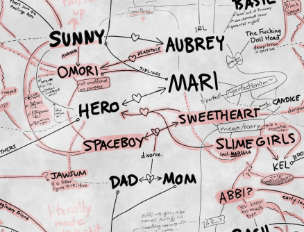

<main>

<h1>What does it mean? <a href="assets/img/helpme.png">What does it all mean?!</a></h1>

- entirety of Headspace is literally Sunny's mindscape
- "[thoughts, feelings, and desires may find expression in the environment, in the medium of the story itself, and in the form of other characters](https://archiveofourown.org/works/20481008)"
- thesis of [<i>How to Read Literature Like a Professor</i>](https://archive.org/details/how-to-read-literature-like-a-professor-1st): the ~~curtains~~ stairs are never "just" blue
- general idea of subconscious depths, some thoughts more forbidden than others
- "[It is likely that this early version of Mari [from 2014] was named <b>Mary</b> [...] names of the Something variants such as Dorothi originally [ended] in a 'y'.](https://omori.fandom.com/wiki/MARI#TRIVIA)"
- "[Of course, beheading has always symbolised the exercise of absolute power.](https://www.bbc.com/culture/article/20161118-the-horror-of-the-headless-horseman)"
- L
- ratio
- You are going to be haunted by this game for a very long time.

</main><!--notes for later: Rococo/artist girl/Angel (latter links to Mari/Sunny; scary big sis??); pigtails (f!Omori, Sweetheart, that one imaginary friend/beta character); I forgot to write "parents" from Dad+Mom but I'll probably redo this from scratch later anyway whoops-->