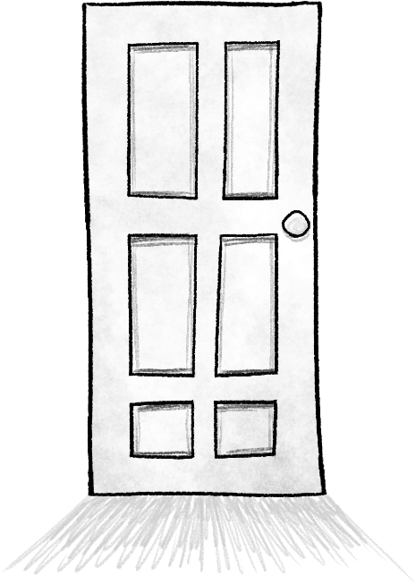

<header><h1>Welcome.</h1></header>

<main markdown="1">
Fansite for the game <a href="https://www.omori-game.com/en/"><i class="omo">Omori</i></a>. **Here there be spoilers.** Same content warnings as the actual game apply.

[The sitemaker](https://a-flyleaf.github.io/) *strongly* recommends you play through the game at least once, ideally unspoiled as possible, before diving into fan content---which is what this site was created to house. Yes, it's taken over my life a little. I had to put it *somewhere*.

Click the door above to enter.
</main>